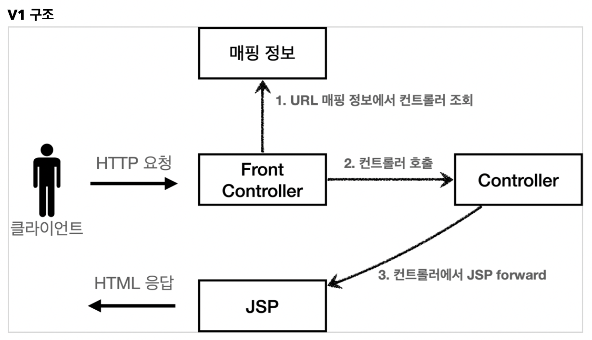
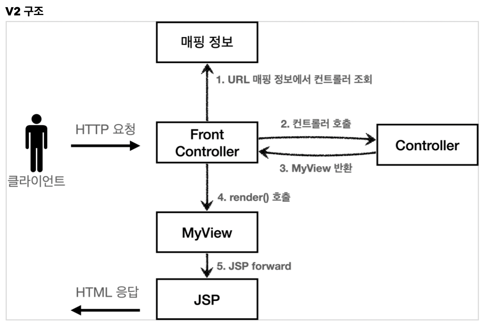
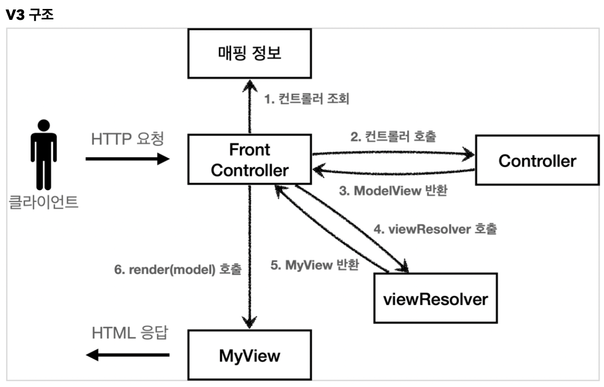
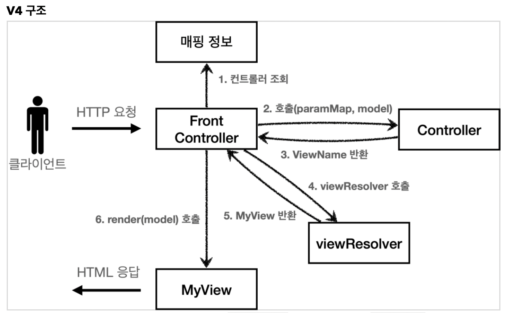
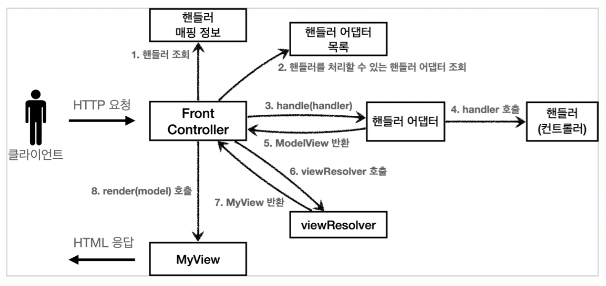

## **Table of Contents**

---

</br>

- [**Table of Contents**](#table-of-contents)
- [**PART1**](#part1)
  - [**PART1 프로젝트 생성**](#part1-프로젝트-생성)
  - [**Section1 웹 애플리케이션 이해**](#section1-웹-애플리케이션-이해)
  - [**Section2 서블릿**](#section2-서블릿)
    - [**서블릿 컨테이너**](#서블릿-컨테이너)
    - [**서블릿 컨테이너 동작 방식**](#서블릿-컨테이너-동작-방식)
    - [\*\*HttpServletRequest 역할](#httpservletrequest-역할)
    - [**HTTP 요청 데이터 - 개요**](#http-요청-데이터---개요)
      - [**HTTP GET 쿼리 파라미터 조회**](#http-get-쿼리-파라미터-조회)
      - [**HTTP POST HTML Form**](#http-post-html-form)
      - [**HTTP API 메시지 바디 - 단순 텍스트**](#http-api-메시지-바디---단순-텍스트)
      - [**HTTP API 메시지 바디 - JSON**](#http-api-메시지-바디---json)
    - [**HttpServletResponse - 기본 사용법**](#httpservletresponse---기본-사용법)
    - [**HTTP 응답 데이터 - 단순 텍스트, HTML**](#http-응답-데이터---단순-텍스트-html)
    - [**HTTP 응답 데이터 - API JSON**](#http-응답-데이터---api-json)
  - [**Section3 서블릿,JSP,MVC패턴**](#section3-서블릿jspmvc패턴)
  - [**Section4 VC프레임워크 만들기**](#section4-vc프레임워크-만들기)
    - [**V1**](#v1)
    - [**V2**](#v2)
    - [**V3**](#v3)
    - [**V4**](#v4)
    - [**V5**](#v5)
  - [**Section5 스프링 MVC - 구조 이해**](#section5-스프링-mvc---구조-이해)
  - [**Section6 스프링 MVC - 기본 기능**](#section6-스프링-mvc---기본-기능)
    - [**Logging**](#logging)
    - [**요청 매핑**](#요청-매핑)
    - [**요청 매핑 - API 예시**](#요청-매핑---api-예시)
    - [**HTTP 요청 - 기본, 헤더조회**](#http-요청---기본-헤더조회)
    - [**HTTP 요청 파라미터 - 쿼리 파라미터, HTML Form**](#http-요청-파라미터---쿼리-파라미터-html-form)
  - [**Section7 스프링 MVC - 웹 페이지 만들기**](#section7-스프링-mvc---웹-페이지-만들기)
- [**PART2**](#part2)
  - [**PART2 프로젝트 생성**](#part2-프로젝트-생성)
  - [**Section1타임리프 - 기본 기능**](#section1타임리프---기본-기능)
  - [**Section2타임리프 - 스프링 통합과 폼**](#section2타임리프---스프링-통합과-폼)
  - [**Section3메시지, 국제화**](#section3메시지-국제화)
  - [**Section4Validation**](#section4validation)
  - [**Section5Bean Validation**](#section5bean-validation)
  - [**Section6로그인 처리1 - 쿠키, 세션**](#section6로그인-처리1---쿠키-세션)
  - [**Section7로그인 처리2 - 필터, 인터셉터**](#section7로그인-처리2---필터-인터셉터)
  - [**Section8예외 처리와 오류 페이지**](#section8예외-처리와-오류-페이지)
  - [**Section9API 예외 처리**](#section9api-예외-처리)
  - [**Section10스프링 타입 컨버터**](#section10스프링-타입-컨버터)

</br>

## **PART1**

---

</br>

### **PART1 프로젝트 생성**

- Project : Gradle
- Spring boot : 2.6.2
- Language : JAVA
- Packaging : War
- JAVA ver. : 11
- Project Meta
  - Group : mvc1
  - Artifact : servlet
  - name : servlet
  - Dependencies : Spring Web, Lombok

</br>

### **Section1 웹 애플리케이션 이해**

</br>

- Web Server

  - 정적 리소스 제공(HTML, CSS, JS, image, movie 등)
  - ex) NGINX, APACHE

- WAS

  - 애플리케이션 로직
  - 웹 서버 기능 포함하지만 나눠서 관리하는 것이 효율적.

> - 웹서버 -> 정적리소스 처리
> - 애플리케이션 로직으로 동적이 처리 -> WAS위임
> - 분리 할 경우 각각의 서버 증설 관리 가능

</br>

### **Section2 서블릿**

</br>

> - HTTP 클라이언트 요청을 처리하고 다시 클라이언트에게 응답하는 servlet 클래스 구현 규칙을 지킨 자바 프로그램

</br>

- HTTP 요청 응답 프로세스

  - WAS는 Request, Response 객체 생성 후 서블릿 객체 호출
  - Request 객체에서 HTTP 요청 정보 받아서 사용
  - Response 객체에 HTTP 응답 정보 입력
  - WAS는 Reponse 객체에 담겨 있는 내용으로 HTTP 응답 정보 생성

</br>

#### **서블릿 컨테이너**

</br>

> - 서블릿을 지원하는 WAS
> - 서블릿 객체 생성, 초기화, 호출, 생명주기 관리
> - 서블릿 객체를 `싱글톤`으로 관리
> - 동시 요청을 위한 `멀티 쓰레드` 처리 지원
>   - 서블릿 객체를 쓰레드가 호출함.

</br>

- servlet/src/main/java/mvc1/servlet/basic/HelloServlet.java

```java
@WebServlet(name="helloServlet", urlPatterns = "/hello")
public class HelloServlet extends HttpServlet{

    // servlet 호출 되면 service 함수 호출.
    @Override
    protected void service(HttpServletRequest request, HttpServletResponse response) throws ServletException, IOException {

        System.out.println("HelloServlet.service");
        System.out.println("request = " + request);
        System.out.println("response = " + response);

        String username = request.getParameter("username");
        System.out.println("username = " + username);

        response.setContentType("text/plain");
        response.setCharacterEncoding("utf-8");
        response.getWriter().write("hello " + username);


    }
}

```

- @ServletComponentScan
  - 서블릿 직접 등록해서 사용할 수 있도록 지원

</br>

- @WebServlet(name="helloServlet", urlPatterns = "/hello")

  - 서블릿 helloServlet으로 등록 후 /hello url이 호출 되면
  - 서블릿 컨테이너가 service 함수 호출.

</br>

- HTTP 스펙에 맞게 헤더 설정 및 파라미터 받아오기.

</br>

- HTTP 요청 메시지 로그로 확인 하기

```java

//servlet/src/main/resources/application.properties 에 추가

logging.level.org.apache.coyote.http11=debug

```

> - 주의
>   - 개발 단계에서만 사용할 것
>   - 로그를 찍을 경우 운영상에서는 성능 문제.

</br>

#### **서블릿 컨테이너 동작 방식**

</br>

- client가 `HTTP 요청메시지 송신`
- 웹서버는 HTTP 요청 해석 후 서블릿에 대한 요청이면 `서블릿 컨테이너로 요청 전달`
- 서블릿 컨테이너는 해당 서블릿 생성 후 `service() 메서드 호출`
- 서블릿은 서비스 수행 후 `응답을 웹서버에게 전달`
- 웹서버는 클라이언트에게 웹페이지를 HTTP 응답으로 전달

</br>

#### \*\*HttpServletRequest 역할

</br>

> - HTTP 요청을 편리하게 사용하도록 HTTP 요청 파싱
> - 그 후 HttpServletRequest 객체에 담아서 제공

</br>

- **HttpServlet 기본 사용법**

</br>

```java

@WebServlet(name = "requestHeaderServlet", urlPatterns = "/request-header")
public class RequestHeaderServlet extends HttpServlet {

    @Override
    protected void service(HttpServletRequest request, HttpServletResponse response) throws ServletException, IOException {

        printStartLine(request);
        printHeaders(request);
        printHeaderUtils(request);
        printEtc(request);
        response.getWriter().write("ok");

    }

    //start line 정보
    private void printStartLine(HttpServletRequest request) {
        System.out.println("--- REQUEST-LINE - start ---");
        System.out.println("request.getMethod() = " + request.getMethod()); //GET
        System.out.println("request.getProtocal() = " + request.getProtocol()); // HTTP/1.1
        System.out.println("request.getScheme() = " + request.getScheme()); //http
        // http://localhost:8080/request-header
        System.out.println("request.getRequestURL() = " + request.getRequestURL());
        // /request-test
        System.out.println("request.getRequestURI() = " + request.getRequestURI());
        //username=hi
        System.out.println("request.getQueryString() = " +
                request.getQueryString());
        System.out.println("request.isSecure() = " + request.isSecure()); //https 사용 유무
        System.out.println("--- REQUEST-LINE - end ---");
        System.out.println();
    }

    //Header 모든 정보
    private void printHeaders(HttpServletRequest request) {
        System.out.println("--- Headers - start ---");
  /*
      Enumeration<String> headerNames = request.getHeaderNames();
      while (headerNames.hasMoreElements()) {
          String headerName = headerNames.nextElement();
          System.out.println(headerName + ": " + request.getHeader(headerName));
      }
*/
        request.getHeaderNames().asIterator()
                .forEachRemaining(headerName -> System.out.println(headerName + " : " + request.getHeader(headerName)));
        System.out.println("--- Headers - end ---");
        System.out.println();
    }

    //Header 편리한 조회
    private void printHeaderUtils(HttpServletRequest request) {

        System.out.println("--- Header 편의 조회 start ---");

        System.out.println("[Host 편의 조회]");
        System.out.println("request.getServerName() = " + request.getServerName()); //Host 헤더

        System.out.println("request.getServerPort() = " + request.getServerPort()); //Host 헤더 System.out.println();
        System.out.println();

        System.out.println("[Accept-Language 편의 조회]"); request.getLocales().asIterator()
                .forEachRemaining(locale -> System.out.println("locale = " + locale));

        System.out.println("request.getLocale() = " + request.getLocale());
        System.out.println();

        System.out.println("[cookie 편의 조회]");
        if (request.getCookies() != null) {
            for (Cookie cookie : request.getCookies()) {
                System.out.println(cookie.getName() + ": " + cookie.getValue());
            }
        }

        System.out.println();

        System.out.println("[Content 편의 조회]");
        System.out.println("request.getContentType() = " +
                request.getContentType());
        System.out.println("request.getContentLength() = " +
                request.getContentLength());
        System.out.println("request.getCharacterEncoding() = " +
                request.getCharacterEncoding());

        System.out.println("--- Header 편의 조회 end ---");
        System.out.println();
    }

    private void printEtc(HttpServletRequest request) {

        System.out.println("--- 기타 조회 start ---");
        System.out.println("[Remote 정보]");
        System.out.println("request.getRemoteHost() = " +
                request.getRemoteHost()); //
        System.out.println("request.getRemoteAddr() = " +
                request.getRemoteAddr()); //
        System.out.println("request.getRemotePort() = " +
                request.getRemotePort()); //
        System.out.println();
        System.out.println("[Local 정보]");
        System.out.println("request.getLocalName() = " +
                request.getLocalName()); //
        System.out.println("request.getLocalAddr() = " +
                request.getLocalAddr()); //
        System.out.println("request.getLocalPort() = " +
                request.getLocalPort()); //
        System.out.println("--- 기타 조회 end ---");
        System.out.println();
    }
}

```

</br>

- **추가 기능**
  - 저장: request.setAttribute(name,value)
  - 조회 : request.getAttribute(name)
  - 세션 관리 : request.getSession(craete : true)

</br>

#### **HTTP 요청 데이터 - 개요**

</br>

- GET - 쿼리 파라미터 : /url`?username=**&age=##`

  - 메시지 바디 없이, url의 쿼리 파라미터에 데이터 포함 후 전달`(검색, 필터, 페이징)`

- POST - HTML Form

  - content-type : application/x-www-form-rulencoded
  - 메시지 바디에 쿼리 파라미터 형식으로 전달 : username=\*\*&age=##

- HTTP message body에 데이터 직접 담아서 요청
  - HTTP API에서 주로 사용(JSON, XML, TEXT)

</br>

##### **HTTP GET 쿼리 파라미터 조회**

```java
// servlet/src/main/java/mvc1/servlet/basic/request/RequestParamServlet.java


package mvc1.servlet.basic.request;

import javax.servlet.ServletException;
import javax.servlet.annotation.WebServlet;
import javax.servlet.http.HttpServlet;
import javax.servlet.http.HttpServletRequest;
import javax.servlet.http.HttpServletResponse;
import java.io.IOException;

/**
 *  1. 쿼리 파라미터 전송 가능
 *  http://localhost:8080/request-param?username=kim&age=20
 *
 *  2. 동일한 파라미터 전송 가능
 *  http://localhost:8080/request-param?useranme=kim&username=jung&age=30
 * */


@WebServlet(name = "requestParamServlet", urlPatterns = "/request-param")
public class RequestParamServlet extends HttpServlet {

    @Override
    protected void service(HttpServletRequest request, HttpServletResponse response) throws ServletException, IOException {

        System.out.println("[전체 파라미터 조회] - start");
        request.getParameterNames().asIterator()
                .forEachRemaining(paramName -> System.out.println(paramName + "=" + request.getParameter(paramName)));
        System.out.println("[전체 파라미터 조회 - end]");
        System.out.println();

        System.out.println("[단일 파라미터 조회]");
        String username = request.getParameter("username");
        System.out.println("request.getParameter(username) = " + username);

        String age = request.getParameter("age");
        System.out.println("request.getParameter(age) = " + age);
        System.out.println();

        System.out.println("[이름이 같은 복수 파라미터 조회]");
        System.out.println("request.getParameterValues(username)");
        String[] usernames = request.getParameterValues("username");
        for(String name : usernames){
            System.out.println("username=" + name);
        }

        response.getWriter().write("ok");
    }
}

```

</br>

##### **HTTP POST HTML Form**

> - request.getParameter()로 조회 가능
>   - contentType이 application/x-www-form-urlencoded 동일
>   - GET의 쿼리파라미터가 POST에서는 message body에서 형식 동일

</br>

##### **HTTP API 메시지 바디 - 단순 텍스트**

</br>

> - HTTP message body에 데이터를 직접 담아서 요청
>   - HTTP API에서 주로 사용, JSON, XML, TEXT
>   - 데이터 형식은 주로 JSON
>   - POST, PUT, PATCh

```java
// servlet/src/main/java/mvc1/servlet/basic/request/RequestBodyStringServlet.java

package mvc1.servlet.basic.request;

import org.springframework.util.StreamUtils;

import javax.servlet.ServletException;
import javax.servlet.ServletInputStream;
import javax.servlet.annotation.WebServlet;
import javax.servlet.http.HttpServlet;
import javax.servlet.http.HttpServletRequest;
import javax.servlet.http.HttpServletResponse;
import java.io.IOException;
import java.nio.charset.StandardCharsets;

@WebServlet(name = "requestBodyStringServlet", urlPatterns = "/request-body-string")
public class RequestBodyStringServlet extends HttpServlet {

    @Override
    protected void service(HttpServletRequest request, HttpServletResponse response) throws ServletException, IOException {

        // HTTP 메시지 바디의 데이터를 InputStream으로 읽기
        ServletInputStream inputStream = request.getInputStream();

        // byte -> String : charset 지정은 UTF_8
        String messageBody = StreamUtils.copyToString(inputStream, StandardCharsets.UTF_8);

        System.out.println("messageBody = " + messageBody);

        response.getWriter().write("ok");

    }
}

```

> - inputStream은 byte 코드 반환
> - byte 코드 -> String : Charset 지정 필요

</br>

##### **HTTP API 메시지 바디 - JSON**

</br>

> - JSON 형식 전송
>   - content-type : application/json
>   - message body : {"username" : "xx", "age" : xx}

</br>

- Json 형식 파싱 추가(servlet/src/main/java/mvc1/servlet/basic/HelloData.java)

```java

package mvc1.servlet.basic;

import lombok.Getter;
import lombok.Setter;

@Getter
@Setter
public class HelloData {

    private String username;
    private int age;

}

```

</br>

```java
//servlet/src/main/java/mvc1/servlet/basic/request/RequestBodyJsonServlet.java


package mvc1.servlet.basic.request;

import com.fasterxml.jackson.databind.ObjectMapper;
import mvc1.servlet.basic.HelloData;
import org.springframework.util.StreamUtils;

import javax.servlet.ServletException;
import javax.servlet.ServletInputStream;
import javax.servlet.annotation.WebServlet;
import javax.servlet.http.HttpServlet;
import javax.servlet.http.HttpServletRequest;
import javax.servlet.http.HttpServletResponse;
import java.io.IOException;
import java.nio.charset.StandardCharsets;

@WebServlet(name="RequestBodyJsonServlet", urlPatterns = "/request-body-json")
public class RequestBodyJsonServlet extends HttpServlet {

    /*
    * Json 결과 파싱 후 자배 객체 변환 하려면
    * Jackson, Gson 같은 Json 변환 라이브러리 추가해서 사용 해야함
    * Spring MVC 선택하면 Jackson 라이브러리 ObjectMapper 사용
    *
    * */
    private ObjectMapper objectMapper = new ObjectMapper();

    @Override
    protected void service(HttpServletRequest request, HttpServletResponse response) throws ServletException, IOException {

        ServletInputStream inputStream = request.getInputStream();

        String messageBody = StreamUtils.copyToString(inputStream, StandardCharsets.UTF_8);

        HelloData helloData = objectMapper.readValue(messageBody,HelloData.class);

        System.out.println("helloData.username = " + helloData.getUsername());
        System.out.println("helloData.age = " + helloData.getAge());

        response.getWriter().write("ok");


    }
}


```

</br>

#### **HttpServletResponse - 기본 사용법**

</br>

> - HTTP 응답 메시지 생성
>   - HTTP 응답 코드 지정
>   - 헤더 생성
>   - 바디 생성
> - 편의 기능 제공
>   - Content-Type
>   - 쿠키
>   - Redirect

```java
// servlet/src/main/java/mvc1/servlet/basic/response/ResponseHeaderServlet.java

package mvc1.servlet.basic.response;

import javax.servlet.ServletException;
import javax.servlet.annotation.WebServlet;
import javax.servlet.http.Cookie;
import javax.servlet.http.HttpServlet;
import javax.servlet.http.HttpServletRequest;
import javax.servlet.http.HttpServletResponse;
import java.io.IOException;
import java.io.PrintWriter;

@WebServlet(name="responseHeaderServlet", urlPatterns = "/response-header")
public class ResponseHeaderServlet extends HttpServlet {

    @Override
    protected void service(HttpServletRequest request, HttpServletResponse response) throws ServletException, IOException {
        // [status - line]
        response.setStatus(HttpServletResponse.SC_OK);

        //[response-headers]
        response.setHeader("Content-Type", "text/plain;charset=utf-8");
        // 캐쉬를 무효화 하겠다.
        response.setHeader("Cache-Control","no-cache, no-store, must-revalidate");
        response.setHeader("Pragma", "no-cache");
        response.setHeader("my-header","hello");

        //[Header 편의 메서드]
        content(response);
        cookie(response);
        redirect(response);

        // [message body]
        PrintWriter writer = response.getWriter();
        writer.println("ok");
    }

    private void redirect(HttpServletResponse response) throws IOException{
        //Status Code 302
        //Location: /basic/hello-form.html

        //response.setStatus(HttpServletResponse.SC_FOUND); //302
        //response.setHeader("Location", "/basic/hello-form.html");
        response.sendRedirect("/basic/hello-form.html");
    }

    private void cookie(HttpServletResponse response) {
        //Set-Cookie: myCookie=good; Max-Age=600;
        // response.setHeader("Set-Cookie", "myCookie=good; Max-Age=600");
        Cookie cookie = new Cookie("myCookie", "good");
        cookie.setMaxAge(600);
        response.addCookie(cookie);
    }

    private void content(HttpServletResponse response) {
        //Content-Type: text/plain;charset=utf-8
        //Content-Length: 2
        //response.setHeader("Content-Type", "text/plain;charset=utf-8");
        response.setContentType("text/plain");
        response.setCharacterEncoding("utf-8");
        //response.setContentLength(2); //(생략시 자동 생성)
    }
}

```

</br>

#### **HTTP 응답 데이터 - 단순 텍스트, HTML**

</br>

```java

package mvc1.servlet.basic.response;

import javax.servlet.ServletException;
import javax.servlet.annotation.WebServlet;
import javax.servlet.http.HttpServlet;
import javax.servlet.http.HttpServletRequest;
import javax.servlet.http.HttpServletResponse;
import java.io.IOException;
import java.io.PrintWriter;

@WebServlet(name = "responseHtmlServlet", urlPatterns = "/response-html")
public class ResponseHtmlServlet extends HttpServlet {

    @Override
    protected void service(HttpServletRequest request, HttpServletResponse response) throws ServletException, IOException {
       //Content-Type : text/html; charset = utf-8
       response.setContentType("text/html");
       response.setCharacterEncoding("utf-8");

        PrintWriter writer = response.getWriter();
        writer.println("<html>");
        writer.println("<body>");
        writer.println("<div>안녕?</div>");
        writer.println("</body>");
        writer.println("</html>");

    }
}


```

</br>

#### **HTTP 응답 데이터 - API JSON**

</br>

```java
//servlet/src/main/java/mvc1/servlet/basic/response/ResponseJsonServlet.java

package mvc1.servlet.basic.response;

import com.fasterxml.jackson.databind.ObjectMapper;
import mvc1.servlet.basic.HelloData;

import javax.servlet.ServletException;
import javax.servlet.annotation.WebServlet;
import javax.servlet.http.HttpServlet;
import javax.servlet.http.HttpServletRequest;
import javax.servlet.http.HttpServletResponse;
import java.io.IOException;

@WebServlet(name = "responseJsonServlet", urlPatterns = "/response-json")
public class ResponseJsonServlet extends HttpServlet {

    private ObjectMapper objectMapper = new ObjectMapper();

    @Override
    protected void service(HttpServletRequest request, HttpServletResponse response) throws ServletException, IOException {
        // Content-Type : application/json
        response.setContentType("application/json");
        response.setCharacterEncoding("utf-8");

        HelloData helloData = new HelloData();
        helloData.setUsername("kim");
        helloData.setAge(20);

        // {"username" : "kim", "age" : 20}
        // 객체를 JSON 문자로 변경
        String result = objectMapper.writeValueAsString(helloData);
        response.getWriter().write(result);

    }
}

```

</br>

### **Section3 서블릿,JSP,MVC패턴**

---

- 서블릿과 JSP의 문제

> - view 화면을 위한 HTML 만드는 작업이 자바코드와 섞임
> - JSP는 HTML 작업을 가져가고, 중간 중간 동적으로 변경 부분만 자바 코드 적용
> - but, 그러나 JSP에서도 너무 많은 작업을 담당함.
> - 우선 변경 cycle이 다르기 때문에 유지 보수 어려움

- MVC 패턴

> - Modle : 뷰로 전달할 데이터를 저장.
> - View : 모델에 담겨 있는 데이터를 사용하여 화면 랜더링
> - Controller : HTTP 요청 받고, 파라미터 검증 이후 비즈니스 로직 실행, 또 뷰에 전달할 데이터를 모델에 담아 전달

</br>
</br>
</br>

### **Section4 VC프레임워크 만들기**

</br>

#### **V1**

</br>

|        **v1 구조**        |
| :-----------------------: |
|  |

</br>

> - URL 매핑 정보를 통해 controller 조회
> - controller 호출
> - JSP forward
> - 모든 컨트롤러에서 뷰로 이동하는 부분에 중복 발생

</br>

#### **V2**

</br>

|        **v2 구조**        |
| :-----------------------: |
|  |

</br>

> - URL 통해 controller 조회
> - controller 호출
> - MyView 반환 후 랜더링
> - JSP forward
> - 여전히 서블릿 종속성과 뷰 이름 중복 문제

</br>

#### **V3**

</br>

|          v3 구조          |
| :-----------------------: |
|  |

</br>

> - URL 통해 controller 조회
> - controller 호출
> - ModelView 반환
> - viewResolver로 물리 경로 생성
> - MyView 반환 한 후 랜더링
> - ModeView 객체를 생성하고 반환해야하는 번거로움

</br>

#### **V4**

</br>

|          v4 구조          |
| :-----------------------: |
|  |

</br>

> - URL controller 조회
> - controller 호출
> - viewName(논리 경로) 반환
> - viewResolver로 물리 경로 생성
> - Myview를 반환 받고 랜더링

</br>

#### **V5**

</br>

|          v5 구조          |
| :-----------------------: |
|  |

</br>

- Controller에 종속적이지 않게 만들기
- Controller가 URL 통해 handler 조회
- 조회한 handler를 처리할 수 있는 adapter 조회
- handler 어댑터에서 handler 실행(Controller 역할)
- ModelView 반환
- viewResolver를 호출 하여 MyView 반환
- 랜더링

</br>
</br>
</br>

### **Section5 스프링 MVC - 구조 이해**

</br>

</br>

### **Section6 스프링 MVC - 기본 기능**

</br>

#### **Logging**

</br>

- 선언

> @Slf4j -> lombok annotation 사용  
> private Logger log = LoggerFactory.getLogger(getClass())  
> private Logger log = LoggerFactory.geLogger(xxx.class)

</br>

- log 단계

| level |            description             |
| :---: | :--------------------------------: |
| trace |           local 서버에서           |
| info  |           개발 서버에서            |
| debug | 운영 서버에서도 봐야할 중요한 정보 |
| warn  |                경고                |
| error |                에러                |

</br>

- 설정 (application.properties)

</br>

> logging.level.practice.springmvc=level

</br>

- 올바른 로그 사용법

</br>

|          나쁜 예          |         좋은 예          |
| :-----------------------: | :----------------------: |
| log.info("data =" + data) | log.info("data={}",data) |

</br>

> "data =" +data -> 문자열 더하기 연산 실행  
> 심지어 로그 레벨이 아닐때도 더하기 연산이 발생되어 성능 저하

</br>

- 로그 사용시 장점

> 쓰레드 정보나 클래스 이름같은 부가 정보도 함께 볼 수 있음.
> 로그를 상황에 따라(개발 서버 or 운영서버) 출력 가능
> 파일, 네트워크 등 로그를 별도의 위치에 남길 수 있음.
> System.out보다 성능이 좋음

</br>

#### **요청 매핑**

</br>

- @Controller 와 @RestController 차이

</br>

> String 반환 시  
> `@Controller`는 뷰로 인식 -> 뷰를 찾고 뷰가 랜더링
> `@RestController`는 HTTP 메시지 바디에 바로 입력

</br>

- PathVariable(경로 변수 사용)

</br>

```java

@GetMapping("/mapping/users/{userId}/orders/{orderId}")
    public String mappingPath(@PathVariable String userId, @PathVariable String orderId){
        log.info("mappingPath userId = {}",userId);
        log.info("mappingPath orderId = {}",orderId);

        return "ok";
    }

```

</br>

> 최근 HTTP API는 리소스 경로에 식별자 넣는 스타일 선호
> @PathVarible의 이름과 파라미터 이름이 같으면 생략 가능

</br>

- 특정 파라미터 조건 매핑

</br>

```java

@GetMapping(value = "/mapping-param", params = "mode=debug")
    public String mappingParam(){
        log.info("mappingParam");
        return "ok";
    }

```

</br>

- 특정 헤더 조건 매핑

</br>

```java

@GetMapping(value = "/mapping-header", headers = "mode=debug")
    public String mappingHeader(){
        log.info("mappingHeader");
        return "ok";
    }


```

- 미디어 타입 조건 매핑 - HTTP 요청 Content-Type, consume

</br>

```java

@PostMapping(value = "/mapping-consume", consumes = MediaType.APPLICATION_JSON_VALUE)
    public String mappingConsumes(){
        log.info("mappingConsumes");
        return "ok";
    }

```

</br>

- 미디어 타입 조건 매핑 - HTTP 요청 Accept, produce

</br>

```java

@PostMapping(value = "mapping-produce", produces = MediaType.TEXT_HTML_VALUE)
    public String mappingProduces(){
        log.info("mappingProduces");
        return "ok";
    }

```

</br>

#### **요청 매핑 - API 예시**

</br>

```java

package practice.springmvc.basic.requestMapping;

import org.springframework.web.bind.annotation.*;

@RestController
@RequestMapping("/mapping/users")
public class MappingClassController {

    @GetMapping
    public String users(){
        return "get users";
    }

    @PostMapping
    public String addUser(){
        return "post user";
    }

    @GetMapping("/{userId}")
    public String findUser(@PathVariable String userId){
        return "get userId=" +userId;
    }

    @PatchMapping("/{userId}")
    public String updateUser(@PathVariable String userId){
        return "update userId="+userId;
    }

    @DeleteMapping("/{userId}")
    public String deleteUser(@PathVariable String userId){
        return "delete userId="+userId;
    }
}

```

</br>

> class level에 매핑 정보 설정  
> 이후 method level에서 해당 정보 조합 후 사용

</br>

#### **HTTP 요청 - 기본, 헤더조회**

#### **HTTP 요청 파라미터 - 쿼리 파라미터, HTML Form**

### **Section7 스프링 MVC - 웹 페이지 만들기**

</br>

</br>
</br>
</br>

## **PART2**

---

</br>

### **PART2 프로젝트 생성**

</br>

### **Section1타임리프 - 기본 기능**

</br>

</br>

### **Section2타임리프 - 스프링 통합과 폼**

</br>

</br>

### **Section3메시지, 국제화**

</br>

</br>

### **Section4Validation**

</br>

</br>

### **Section5Bean Validation**

</br>

</br>

### **Section6로그인 처리1 - 쿠키, 세션**

</br>

</br>

### **Section7로그인 처리2 - 필터, 인터셉터**

</br>

</br>

### **Section8예외 처리와 오류 페이지**

</br>

</br>

### **Section9API 예외 처리**

</br>

</br>

### **Section10스프링 타입 컨버터**

</br>

</br>
